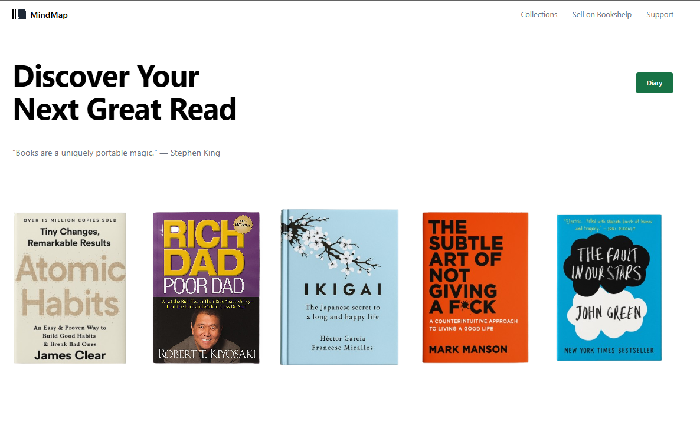

<div align="center">

# 📚 MindMap

**Discover, Read, Journal, paint Connect—Build a community for spreading positive mindset**

> A modern product e-commerce marketplace only focusing on mind ful products to promote mental well being.


---



---

</div>

## 📖 Overview

With an aim to help people with their mental well-being. I am creating this project. It is my idea I am going to build it from scratch.
**Bookshelp** is a full-stack e-commerce platform designed for book lovers. With a modular architecture and clean codebase, it serves as a robust solution for buying, browsing, and managing books with ease.It also features a journal section called diary and an AI powered Support Chatbot for customer queries and recommendations.

### 🔍 Architecture and Planning

- **Modular Monorepo and SOA focused:** Scalable structure separating client and server apps.
- **Fast Development:** Uses modern frameworks like express for app features and python and Fast API for the large language model features. Planning to use best practices of development for better handling of performance.
- **MERN Stack + Fast API + Langchain:** Services, Client, Database, Business logic and services in one place.
- **API:** Starting off with REST APIs, plan to include GraphQL and gRPC in future.
- **Developer Friendly:** Readable code, docs, and extensibility in mind.

---

## 🚀 Getting Started

### Prerequisites

To set up the project, ensure you have:

- **Programming Language:** Python, Javascript
- **Frameworks:** React, Express, Fast API, Langchain
- **Package Manager:** `pip`, `npm`

---

## ⚙️ Installation

Clone the repository and install dependencies.

```bash
git clone https://github.com/subhajitbaidya/book-store.git
```

```bash
cd book-store
# Navigate to each directory and run commands accordingly.
npm install
pip install requirements.txt
```

Set environment variables or configure via `.env`.

---

## ▶️ Usage

Run the project locally:

```

```

---

## 🧪 Testing

Run tests using your preferred testing framework (e.g., PyTest):

```bash
pytest
```

---

## 📬 Feedback

Feel free to raise issues or suggest features via [GitHub Issues](https://github.com/subhajitbaidya/book-store/issues).

---
